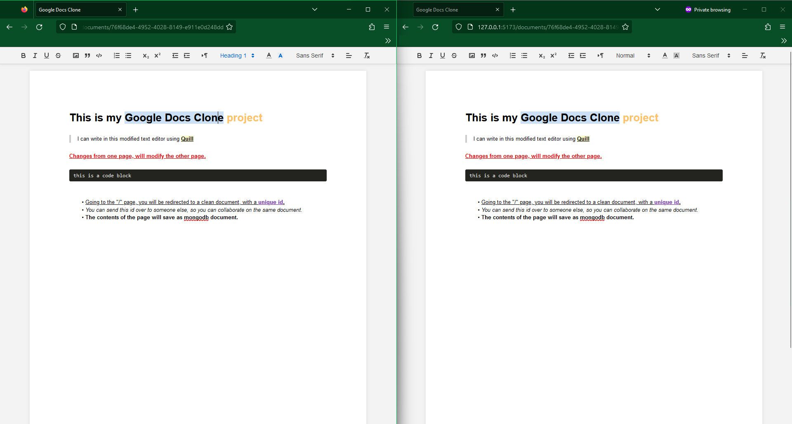

# Google Docs Clone

## Description

Using this video from [Web Dev Simplified](https://www.youtube.com/watch?v=iRaelG7v0OU) I have created a Google Docs Clone using React (+ Typescript + Vite), Quill, Socket.io, Node.js and MongoDB. It allows users to create, edit, and delete documents. It also allows users to share documents with other users and collaborate in real time.

## Installation and Usage

### Server

You will need Node.js and npm.
Starting from the server directory named ``docs-server``, you will firstly need to create a ``config.env`` file inside the ``config`` directory with the following variables:

```bash
MONGO_URI=<your mongo uri>
```

Then you will need to install the dependencies:

```bash
npm install
```

Then you will need to start the server:

```bash
# For production
npm start

# For development
npm run dev
```

### Client

Going over to the client directory named ``docs-client``, you will need to install the dependencies:

```bash
npm install
```

Then you will need to start the client:

```bash
npm run dev
```

### Browser

Open the browser to ``http://127.0.0.1:5173/`` and you should see the app running. You can open multiple tabs to simulate multiple users. To be in the same room, you just need to copy the room id from the url and paste it in this uri ``http://127.0.0.1:5173/documents/<roomId>``, or just copy the url from the first tab and paste it in the other tabs.

## Demo

Looking at the image below you can see two different browsers open, one on the left and one on the right. The left browser is the normal FireFox browser, the right on is incognito. The document is being edited in real time. The way that these users are connected is by sharing the same room id.


